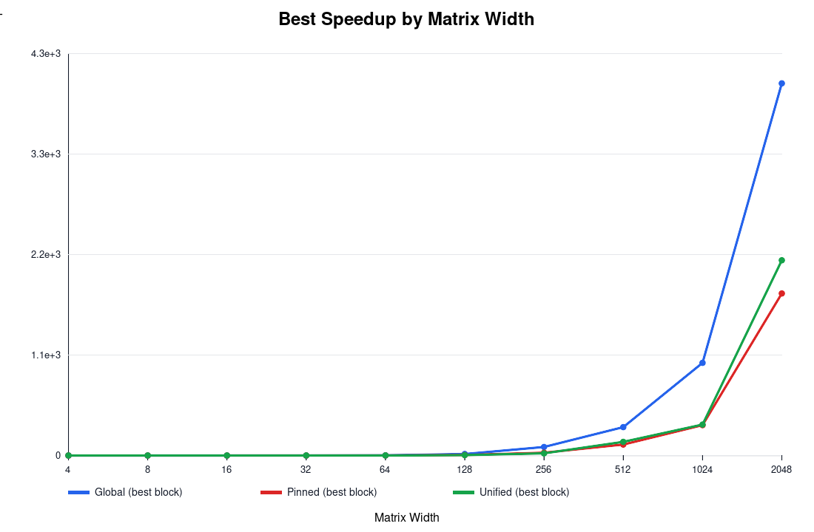
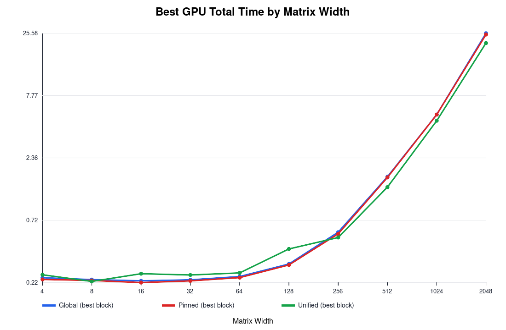
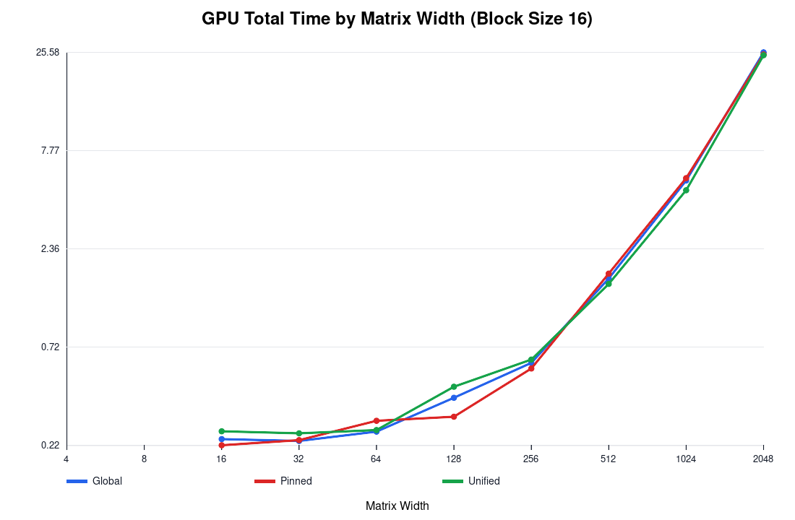
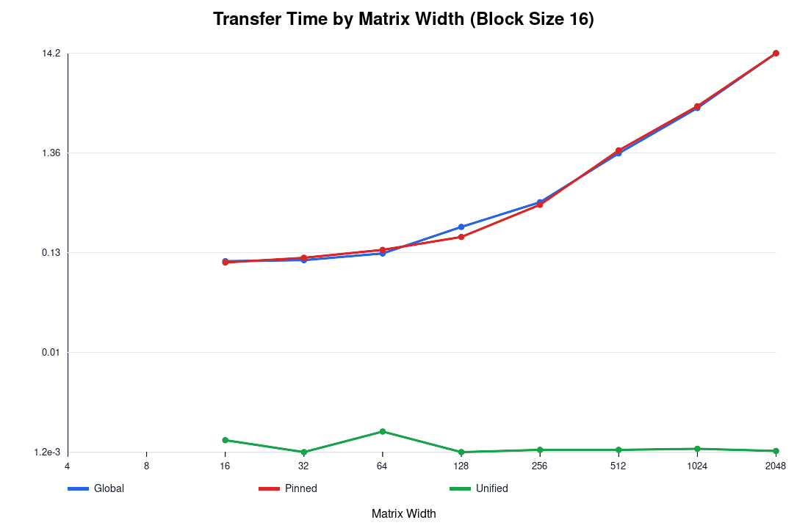
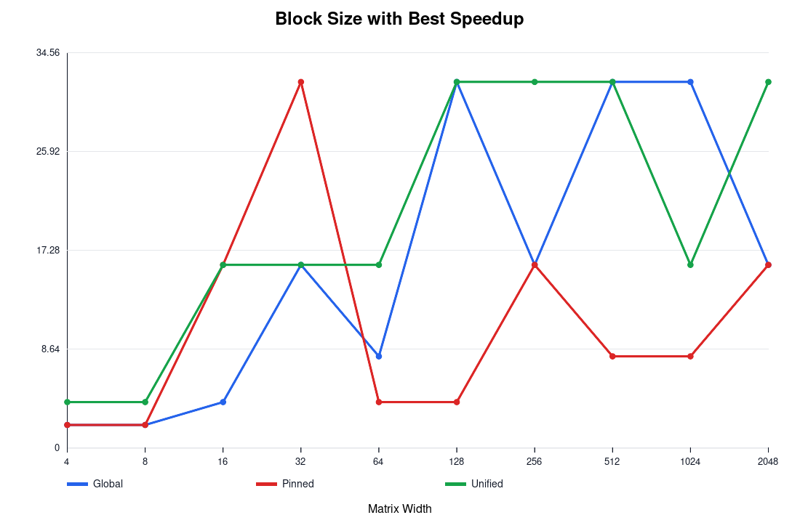
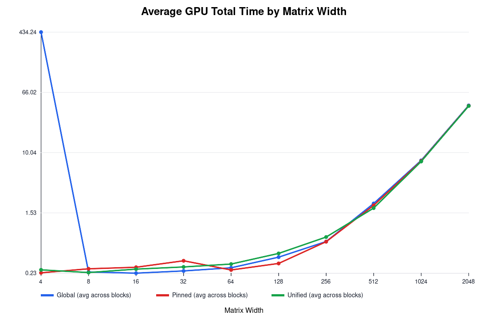

# Comparing different types of GPU memories

## Comparison Charts
**Fig. 1: Best speedup by matrix width**

**Fig. 2: Best GPU total time by matrix width**

**Fig. 3: GPU total time at block size 16**

**Fig. 4: Transfer time at block size 16**

**Fig. 5: Block size with best speedup**

**Fig. 6: Average GPU total time by matrix width (avg over block sizes)**

## Findings

For small widths from around 4 to 32, speedup is around zero or below most of the times. This is because the overhead of launching combined with memory overhead is bigger than the actual computational work.

At block sizes above or equal to 512, all three versions accelerate by quite lot. Best speedups I measured:

- `Global`: `4026.726x` at width `2048`, block `16`
- `Pinned`: `1753.446x` at width `2048`, block `16`
- `Unified`: `2112.387x` at width `2048`, block `32`

### 3) Unified reports dramatically lower transfer time (probably bugged)
Unified shows transfer times around `~0.0012 ms` across sizes, while global and pinned rise with matrix width (up to about `14 ms` at width `2048`).

That lines up with what I’d expect from unified memory since copies are mostly hidden compared to regular host-device copies since it works in the background and tries to be as non-intrusive as possible. I'd need to look into the actual architecture and algorithms, but I'd expect it to not be a stop-the-world type scenario and more of a background/parallel process that fetches memory.

Looking at best-case GPU total time by width:

- Width `512`: Unified best `1.349 ms` (block `32`)
- Width `1024`: Unified best `4.799 ms` (block `16`)
- Width `2048`: Unified best `21.199 ms` (block `32`)

Pinned and global are close in some places, but unified typically wins in these larger cases. Again, it's fairly even in the smaller cases because the computation time essentially doesn't matter because we end up benching the transfer time instead

As matrix width increases, the best speedup usually comes from block size `16` or `32`. Smaller blocks (`2`, `4`) generally leave performance on the table. It's interesting how sometimes the best size is 16 since i'd expect 32 to be better since it fills an entire warp.

tl;dr, from both the charts and data tables, i learned that
- For large `n`, matrix multiply has enough work to fully use GPU parallelism
- For small `n`, fixed overhead dominates
- Compute work grows as `O(n^3)`, while transfer grows at a rate closer to `O(n^2)`, so bigger matrices end up favoring the GPU more and more
- Block sizes around `16/32` tend to give better utilization/occupancy

Note: speedup uses each run’s own CPU baseline. Since CPU times differ across the three result files, direct speedup-vs-speedup comparisons across modes are not perfectly apples-to-apples.

So for strict cross-mode comparison, I'd trust `GPU Total Time` and `Transfer Time` more than raw speedup alone.

In conclusion, if I care most about end-to-end GPU time in this dataset, `Unified` is usually the best choice. At the same time, `Pinned` and `Global` are still strong, just generally a bit slower in best-case large-width runs and for tiny matrices, CPU is always the winner.

## Tables

Global Memory:

| Matrix Width | Block Size | CPU Time (ms) | GPU Total Time (ms) | Total Data Transfer Time (ms) | GPU Processing Time (ms) | Speedup |
| --- | --- | --- | --- | --- | --- | --- |
| 4 | 2 | 0.000000 | 0.756398 | 0.666598 | 0.089800 | 0.000000 |
| 4 | 4 | 0.000000 | 0.739494 | 0.662689 | 0.076805 | 0.000000 |
| 8 | 2 | 0.000000 | 0.664874 | 0.586016 | 0.078858 | 0.000000 |
| 8 | 4 | 0.000000 | 0.667830 | 0.597748 | 0.070082 | 0.000000 |
| 8 | 8 | 0.000000 | 0.832761 | 0.761036 | 0.071725 | 0.000000 |
| 16 | 2 | 0.001000 | 0.690573 | 0.624598 | 0.065975 | 0.001448 |
| 16 | 4 | 0.001000 | 0.752819 | 0.675093 | 0.077726 | 0.001328 |
| 16 | 8 | 0.001000 | 0.744264 | 0.667359 | 0.076905 | 0.001344 |
| 16 | 16 | 0.001000 | 0.737481 | 0.664964 | 0.072517 | 0.001356 |
| 32 | 2 | 0.008000 | 0.766417 | 0.684843 | 0.081574 | 0.010438 |
| 32 | 4 | 0.010000 | 0.778948 | 0.701302 | 0.077646 | 0.012838 |
| 32 | 8 | 0.007000 | 0.745958 | 0.666287 | 0.079671 | 0.009384 |
| 32 | 16 | 0.008000 | 0.667159 | 0.588931 | 0.078228 | 0.011991 |
| 32 | 32 | 0.008000 | 0.735968 | 0.654494 | 0.081474 | 0.010870 |
| 64 | 2 | 0.071000 | 0.852197 | 0.767427 | 0.084770 | 0.083314 |
| 64 | 4 | 0.063000 | 0.852156 | 0.765683 | 0.086473 | 0.073930 |
| 64 | 8 | 0.063000 | 0.945543 | 0.854852 | 0.090691 | 0.066628 |
| 64 | 16 | 0.063000 | 0.866315 | 0.762248 | 0.104067 | 0.072722 |
| 64 | 32 | 0.063000 | 0.872094 | 0.779840 | 0.092254 | 0.072240 |
| 128 | 2 | 0.986000 | 1.366146 | 1.216033 | 0.150113 | 0.721738 |
| 128 | 4 | 0.960000 | 1.417413 | 1.302837 | 0.114576 | 0.677290 |
| 128 | 8 | 0.958000 | 1.856060 | 1.373821 | 0.482239 | 0.516147 |
| 128 | 16 | 0.970000 | 1.362289 | 1.262461 | 0.099828 | 0.712037 |
| 128 | 32 | 0.957000 | 1.343715 | 1.244287 | 0.099428 | 0.712205 |
| 256 | 2 | 10.447000 | 3.731197 | 3.107340 | 0.623857 | 2.799906 |
| 256 | 4 | 10.397000 | 3.218479 | 2.978887 | 0.239592 | 3.230408 |
| 256 | 8 | 10.507000 | 3.300614 | 3.131385 | 0.169229 | 3.183347 |
| 256 | 16 | 10.522000 | 3.255699 | 3.086310 | 0.169389 | 3.231871 |
| 256 | 32 | 10.547000 | 4.147119 | 3.969855 | 0.177264 | 2.543211 |
| 512 | 2 | 220.403000 | 5.928600 | 1.424075 | 4.504525 | 37.176230 |
| 512 | 4 | 220.725998 | 2.644085 | 1.426098 | 1.217987 | 83.479161 |
| 512 | 8 | 221.992996 | 2.098829 | 1.438974 | 0.659855 | 105.769930 |
| 512 | 16 | 221.548996 | 2.110650 | 1.461215 | 0.649435 | 104.967188 |
| 512 | 32 | 221.973007 | 2.074020 | 1.432601 | 0.641419 | 107.025490 |
| 1024 | 2 | 4408.433105 | 37.693359 | 2.318352 | 35.375008 | 116.955167 |
| 1024 | 4 | 3840.277100 | 11.423080 | 2.254531 | 9.168550 | 336.185784 |
| 1024 | 8 | 4119.008789 | 7.051518 | 2.255413 | 4.796105 | 584.130791 |
| 1024 | 16 | 4476.875000 | 7.079230 | 2.241126 | 4.838104 | 632.395755 |
| 1024 | 32 | 4448.898926 | 7.221358 | 2.328852 | 4.892506 | 616.075110 |
| 2048 | 2 | 40972.187500 | 390.832550 | 8.079847 | 382.752716 | 104.833099 |
| 2048 | 4 | 41602.996094 | 106.239380 | 9.026371 | 97.213005 | 391.596752 |
| 2048 | 8 | 41371.207031 | 57.394989 | 8.388709 | 49.006283 | 720.815663 |
| 2048 | 16 | 41386.089844 | 58.807564 | 9.327328 | 49.480236 | 703.754535 |
| 2048 | 32 | 41131.183594 | 57.685371 | 8.069076 | 49.616295 | 713.026247 |

Pinned Memory

| Matrix Width | Block Size | CPU Time (ms) | GPU Total Time (ms) | Total Data Transfer Time (ms) | GPU Processing Time (ms) | Speedup |
| --- | --- | --- | --- | --- | --- | --- |
| 4 | 2 | 0.000000 | 0.237952 | 0.121760 | 0.116192 | 0.000000 |
| 4 | 4 | 0.000000 | 0.230848 | 0.115680 | 0.115168 | 0.000000 |
| 8 | 2 | 0.000000 | 0.226496 | 0.113344 | 0.113152 | 0.000000 |
| 8 | 4 | 0.000000 | 0.230208 | 0.114816 | 0.115392 | 0.000000 |
| 8 | 8 | 0.000000 | 0.340608 | 0.154464 | 0.186144 | 0.000000 |
| 16 | 2 | 0.001000 | 0.286560 | 0.153152 | 0.133408 | 0.003490 |
| 16 | 4 | 0.001000 | 0.288224 | 0.145184 | 0.143040 | 0.003470 |
| 16 | 8 | 0.001000 | 0.323040 | 0.202080 | 0.120960 | 0.003096 |
| 16 | 16 | 0.001000 | 0.217536 | 0.102784 | 0.114752 | 0.004597 |
| 32 | 2 | 0.008000 | 0.688352 | 0.542144 | 0.146208 | 0.011622 |
| 32 | 4 | 0.008000 | 0.274304 | 0.148576 | 0.125728 | 0.029165 |
| 32 | 8 | 0.008000 | 0.288832 | 0.151872 | 0.136960 | 0.027698 |
| 32 | 16 | 0.007000 | 0.231424 | 0.114816 | 0.116608 | 0.030248 |
| 32 | 32 | 0.008000 | 0.224736 | 0.108192 | 0.116544 | 0.035597 |
| 64 | 2 | 0.063000 | 0.266432 | 0.141120 | 0.125312 | 0.236458 |
| 64 | 4 | 0.063000 | 0.239072 | 0.122432 | 0.116640 | 0.263519 |
| 64 | 8 | 0.063000 | 0.240544 | 0.123872 | 0.116672 | 0.261906 |
| 64 | 16 | 0.063000 | 0.292704 | 0.138400 | 0.154304 | 0.215235 |
| 64 | 32 | 0.064000 | 0.241920 | 0.120128 | 0.121792 | 0.264550 |
| 128 | 2 | 0.987000 | 0.326592 | 0.189216 | 0.137376 | 3.022119 |
| 128 | 4 | 1.648000 | 0.304640 | 0.180320 | 0.124320 | 5.409664 |
| 128 | 8 | 0.960000 | 0.317728 | 0.189568 | 0.128160 | 3.021452 |
| 128 | 16 | 0.986000 | 0.307520 | 0.187488 | 0.120032 | 3.206296 |
| 128 | 32 | 1.040000 | 0.314304 | 0.186720 | 0.127584 | 3.308898 |
| 256 | 2 | 10.832001 | 0.728608 | 0.439040 | 0.289568 | 14.866706 |
| 256 | 4 | 11.279000 | 0.579264 | 0.410752 | 0.168512 | 19.471260 |
| 256 | 8 | 10.857000 | 0.578976 | 0.424608 | 0.154368 | 18.752073 |
| 256 | 16 | 10.853001 | 0.551936 | 0.400192 | 0.151744 | 19.663514 |
| 256 | 32 | 12.146001 | 0.661312 | 0.485920 | 0.175392 | 18.366521 |
| 512 | 2 | 224.709015 | 2.780992 | 1.334336 | 1.446656 | 80.801748 |
| 512 | 4 | 225.917007 | 1.826144 | 1.290816 | 0.535328 | 123.712592 |
| 512 | 8 | 224.841003 | 1.623712 | 1.291968 | 0.331744 | 138.473450 |
| 512 | 16 | 223.557007 | 1.746272 | 1.438624 | 0.307648 | 128.019579 |
| 512 | 32 | 225.927017 | 1.668640 | 1.349408 | 0.319232 | 135.395901 |
| 1024 | 2 | 4500.420410 | 14.577663 | 3.883648 | 10.694016 | 308.720294 |
| 1024 | 4 | 4290.791992 | 7.409568 | 4.005920 | 3.403648 | 579.088011 |
| 1024 | 8 | 4486.427246 | 5.720799 | 3.949664 | 1.771136 | 784.230882 |
| 1024 | 16 | 4512.746094 | 5.560864 | 4.070016 | 1.490848 | 811.518874 |
| 1024 | 32 | 4530.449219 | 5.398944 | 3.929024 | 1.469920 | 839.136175 |
| 2048 | 2 | 41839.339844 | 98.906113 | 13.965120 | 84.940994 | 423.020768 |
| 2048 | 4 | 41929.761719 | 40.572094 | 14.414880 | 26.157215 | 1033.463092 |
| 2048 | 8 | 41867.664062 | 27.631361 | 14.476992 | 13.154368 | 1515.222651 |
| 2048 | 16 | 42329.507812 | 24.944321 | 14.160448 | 10.783872 | 1696.959713 |
| 2048 | 32 | 41171.890625 | 25.003328 | 14.263648 | 10.739680 | 1646.656422 |

Unified Memory

| Matrix Width | Block Size | CPU Time (ms) | GPU Total Time (ms) | Total Data Transfer Time (ms) | GPU Processing Time (ms) | Speedup |
| --- | --- | --- | --- | --- | --- | --- |
| 4 | 2 | 0.000000 | 0.262016 | 0.001760 | 0.260256 | 0.000000 |
| 4 | 4 | 0.000000 | 0.252416 | 0.001184 | 0.251232 | 0.000000 |
| 8 | 2 | 0.000000 | 0.235776 | 0.001184 | 0.234592 | 0.000000 |
| 8 | 4 | 0.000000 | 0.222304 | 0.001152 | 0.221152 | 0.000000 |
| 8 | 8 | 0.000000 | 0.250848 | 0.001184 | 0.249664 | 0.000000 |
| 16 | 2 | 0.001000 | 0.270816 | 0.001152 | 0.269664 | 0.003693 |
| 16 | 4 | 0.001000 | 0.263904 | 0.001184 | 0.262720 | 0.003789 |
| 16 | 8 | 0.001000 | 0.259840 | 0.001184 | 0.258656 | 0.003849 |
| 16 | 16 | 0.001000 | 0.257664 | 0.001568 | 0.256096 | 0.003881 |
| 32 | 2 | 0.017000 | 0.304192 | 0.001408 | 0.302784 | 0.055886 |
| 32 | 4 | 0.019000 | 0.292960 | 0.001472 | 0.291488 | 0.064855 |
| 32 | 8 | 0.018000 | 0.300000 | 0.001184 | 0.298816 | 0.060000 |
| 32 | 16 | 0.018000 | 0.251392 | 0.001184 | 0.250208 | 0.071601 |
| 32 | 32 | 0.021000 | 0.259008 | 0.001152 | 0.257856 | 0.081079 |
| 64 | 2 | 0.073000 | 0.325824 | 0.001184 | 0.324640 | 0.224047 |
| 64 | 4 | 0.072000 | 0.349024 | 0.001184 | 0.347840 | 0.206290 |
| 64 | 8 | 0.072000 | 0.328896 | 0.001184 | 0.327712 | 0.218914 |
| 64 | 16 | 0.074000 | 0.261568 | 0.001920 | 0.259648 | 0.282909 |
| 64 | 32 | 0.071000 | 0.276128 | 0.001184 | 0.274944 | 0.257127 |
| 128 | 2 | 0.980000 | 0.434752 | 0.001184 | 0.433568 | 2.254159 |
| 128 | 4 | 0.977000 | 0.428672 | 0.001312 | 0.427360 | 2.279132 |
| 128 | 8 | 0.975000 | 0.429504 | 0.001184 | 0.428320 | 2.270060 |
| 128 | 16 | 1.019000 | 0.442464 | 0.001184 | 0.441280 | 2.303012 |
| 128 | 32 | 0.971000 | 0.413600 | 0.001216 | 0.412384 | 2.347679 |
| 256 | 2 | 10.512000 | 0.983872 | 0.001408 | 0.982464 | 10.684317 |
| 256 | 4 | 10.559001 | 0.841568 | 0.001248 | 0.840320 | 12.546819 |
| 256 | 8 | 10.898001 | 0.630560 | 0.001216 | 0.629344 | 17.283052 |
| 256 | 16 | 10.408001 | 0.615232 | 0.001248 | 0.613984 | 16.917197 |
| 256 | 32 | 10.196000 | 0.514752 | 0.001216 | 0.513536 | 19.807597 |
| 512 | 2 | 208.789017 | 2.564928 | 0.001248 | 2.563680 | 81.401512 |
| 512 | 4 | 210.497009 | 1.787904 | 0.001216 | 1.786688 | 117.733955 |
| 512 | 8 | 208.750015 | 1.625728 | 0.001344 | 1.624384 | 128.404023 |
| 512 | 16 | 210.820007 | 1.540448 | 0.001248 | 1.539200 | 136.856296 |
| 512 | 32 | 214.034012 | 1.349344 | 0.001280 | 1.348064 | 158.620791 |
| 1024 | 2 | 5026.595215 | 14.988064 | 0.001216 | 14.986848 | 335.373215 |
| 1024 | 4 | 4558.365234 | 7.745536 | 0.001344 | 7.744192 | 588.515144 |
| 1024 | 8 | 5024.473145 | 5.707712 | 0.001216 | 5.706496 | 880.295492 |
| 1024 | 16 | 4550.825195 | 4.799489 | 0.001280 | 4.798208 | 948.189525 |
| 1024 | 32 | 5040.452148 | 4.803456 | 0.001248 | 4.802208 | 1049.338674 |
| 2048 | 2 | 51101.250000 | 101.583298 | 0.001216 | 101.582077 | 503.047755 |
| 2048 | 4 | 51399.156250 | 42.019615 | 0.001216 | 42.018398 | 1223.218163 |
| 2048 | 8 | 51066.832031 | 26.174465 | 0.001504 | 26.172960 | 1951.017224 |
| 2048 | 16 | 51162.218750 | 24.703617 | 0.001216 | 24.702400 | 2071.041611 |
| 2048 | 32 | 50925.363281 | 21.199135 | 0.001248 | 21.197887 | 2402.237793 |
